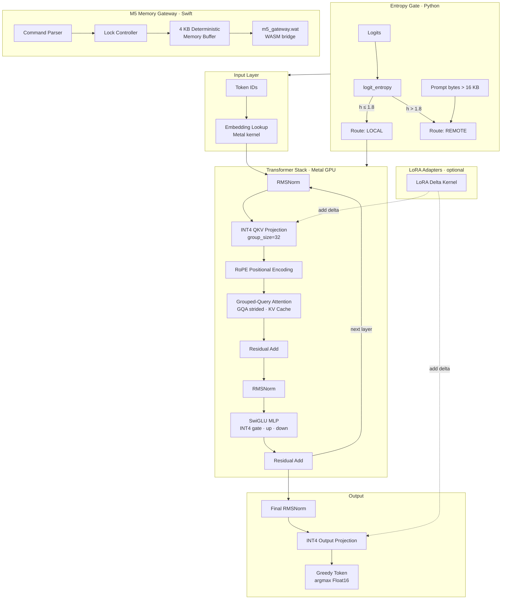
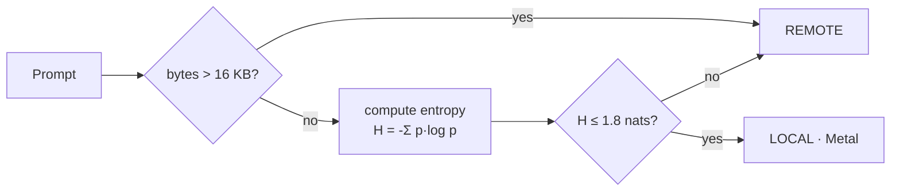
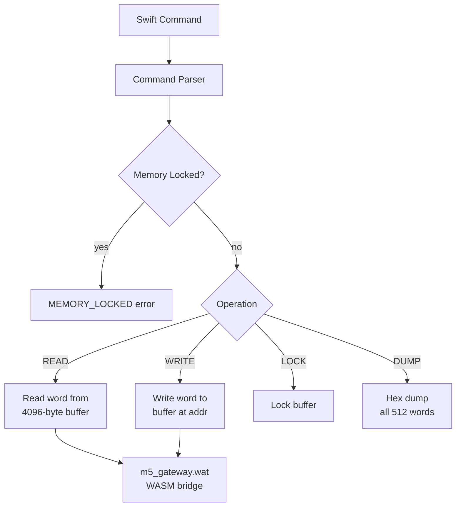

# metal-inference


INT4 quantized transformer inference engine for Apple Silicon. Metal compute shaders run QKV projection, grouped-query attention, SwiGLU MLP, RoPE, and LoRA delta directly on the GPU. An entropy-based routing gate decides local vs. remote execution per request. The M5 Deterministic Memory Gateway provides a lock-controlled OS-layer buffer for deterministic memory access.

---

## Architecture



---

## Components

### `Sources/Kernels/` — Metal Compute Shaders

| Shader | Purpose |
|---|---|
| `int4_transformer.metal` | Full INT4 transformer pass — QKV, attention, MLP |
| `fused_qkv_tiled.metal` | Tiled fused QKV projection |
| `gqa_strided.metal` | Grouped-query attention with strided KV heads |
| `kv_cache.metal` | KV cache read/write |
| `attention.metal` | Attention score computation |
| `rope.metal` | Rotary positional encoding |
| `embedding.metal` | Token embedding lookup |
| `lora_delta.metal` | LoRA weight delta injection |
| `normalization.metal` | RMSNorm |
| `matmul.metal` | General matrix multiply |
| `linear.metal` | Linear projection |
| `mlp.metal` | MLP forward pass |
| `residual.metal` | Residual connection |
| `decode.metal` | Decode-step utilities |
| `output.metal` | Output projection |
| `swiglu` _(in int4)_ | SwiGLU activation |

### `Sources/Host/` — Swift + ObjC++ Runtime

| File | Purpose |
|---|---|
| `MetalTransformer.swift` | Pipeline manager — builds all 13 compute states, dispatches kernels |
| `int4_host_runtime.mm` | INT4 weight packing, dequantization host side |
| `block_layout.h` | INT4 block layout — group_size=32, scale per group |
| `adapter_slot.h` | LoRA adapter slot management |
| `safety.h` | Safety bounds checking |

**Model defaults:** `hidden=3072` · `intermediate=8192` · `heads=24` · `kv_heads=8` · `head_dim=128` · `vocab=32000` · `context=4096`

### `Sources/Gate/` — Entropy Routing Gate (Python)



- `entropy.py` — numerically stable softmax entropy with temperature
- `routing.py` — `decide(logits, policy, envelope) → Route`
- `session.py` — session state
- `directive_guard.py` — directive safety guard
- `crypto.py` — Ed25519 request signing

### `Sources/M5Gateway/` — Deterministic Memory Gateway



4 KB deterministic buffer · 8-byte word size · 512 addressable words · WASM bridge via `m5_gateway.wat`

---

## Build

Requires macOS 13+ with Apple Silicon and Xcode 15+.

```bash
git clone https://github.com/SNAPKITTYWEST/metal-inference.git
cd metal-inference
swift build
swift test
```

Python gate (optional):

```bash
pip install -e "Sources/Gate"
```

---

## INT4 Quantization Format

Weights are packed as nibbles — two INT4 values per byte. Each group of 32 elements shares a `half2` scale factor `(scale, zero_point)`. The host runtime in `int4_host_runtime.mm` handles packing; Metal dequantizes on-the-fly during projection.

```
[ b0_lo:4 | b0_hi:4 ] [ b1_lo:4 | b1_hi:4 ] ... (16 bytes per group of 32)
  └─ scale: half2 per group ─────────────────────┘
```
